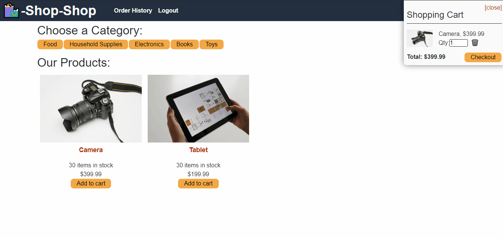

[](https://opensource.org/licenses/MIT)

# Ecommerce Redux Refactor

## Description

This application was designed to refactor an ecommerce website that was managing its state using React's ContextAPI. The objective was to convert the application to manage its state using Redux instead. This involves changing how the state and store are set up within the app along with their reducers.

## Deployed Application

https://rocky-stream-73248.herokuapp.com/

## Table of Contents

* [Screenshots](#screenshots)
* [Installation](#installation)
* [Usage](#usage)
* [Tech Stack](#tech-stack)
* [License](#license)
* [Questions](#questions)

## Screenshots




## Installation

There are a few different steps to getting this application installed and ready to go on your local machine.

Step 1: Install MongoDB if you haven't already. Please refer to online documents to get MongoDB up and running (MongoDB Official Installation Walkthroughs for Windows/Mac/Linux)

Step 2: Clone this repo onto your local machine.

Step 3: Navigate to this project's root directory in your terminal and run the following installation command

```
npm install
```


## Usage

Continuing from the installation instructions, the following steps will help you use this application.

Step 4: Seed the application's data by running the following command at the root of the project directory:

```
npm run seed
```

Step 5: After installing all dependencies and seeding the data, you may invoke the application using:

```
npm run develop
```

This will open the front end and back end concurrently (client, server).

Step 6: Navigate to localhost:3000 in order to view the application locally.

Step 7: Navigate to localhost:3001/graphql in order to access the back end through GraphQL and test queries and mutations

## Tech Stack

- MongoDB
- Mongoose ODM
- Express.js
- React
- React-Router-Dom
- React-Scripts
- React-Boostrap
- Redux
- Node.js
- Apollo Client
- Apollo-Server-Express
- GraphQL
- Nodemon
- JSON Web Tokens

## License

Copyright 2022 Alex Sadrgilany

Permission is hereby granted, free of charge, to any person obtaining a copy 
of this software and associated documentation files (the "Software"), to deal 
in the Software without restriction, including without limitation the rights to 
use, copy, modify, merge, publish, distribute, sublicense, and/or sell copies of the 
Software, and to permit persons to whom the Software is furnished to do so, 
subject to the following conditions:

The above copyright notice and this permission notice shall be included in all 
copies or substantial portions of the Software.

THE SOFTWARE IS PROVIDED "AS IS", WITHOUT WARRANTY OF ANY KIND, EXPRESS OR IMPLIED, 
INCLUDING BUT NOT LIMITED TO THE WARRANTIES OF MERCHANTABILITY, FITNESS FOR A 
PARTICULAR PURPOSE AND NONINFRINGEMENT. IN NO EVENT SHALL THE AUTHORS OR COPYRIGHT 
HOLDERS BE LIABLE FOR ANY CLAIM, DAMAGES OR OTHER LIABILITY, WHETHER IN AN ACTION OF 
CONTRACT, TORT OR OTHERWISE, ARISING FROM, OUT OF OR IN CONNECTION WITH THE SOFTWARE 
OR THE USE OR OTHER DEALINGS IN THE SOFTWARE.

## Questions

[My GitHub Profile](https://github.com/asadg7)

To reach me with questions, please email: asadrgilany7@gmail.com